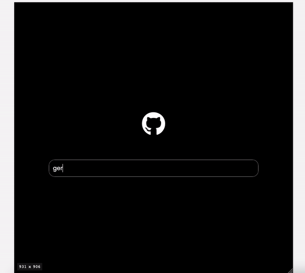

# github-user-api
Project 29(HTML, CSS, JavaScript) from 50 small projects

## Description

Fetch GitHub User API using HTML, CSS and Vanilla JavaScript and AXIOS.

The User card shows name, bio, and latest 10 repos.

* Available at => [CodePen](https://codepen.io/geritooo123/full/bGwZdVJ)

## Demo

